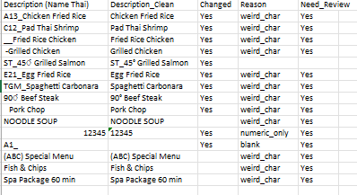

# Item Description Cleaning Automation

Python-based automation tool for cleaning and standardizing item descriptions, with validation to improve data quality and reduce manual effort.

---

## 🔍 Problem

Manual cleaning of item descriptions across multiple resort branches is time-consuming and error-prone, especially with inconsistent formats, prefixes, and unwanted characters.

---

## ⚙️ Solution

This project provides a rule-based data cleaning pipeline using Python to:

* Remove unwanted prefixes and symbols
* Standardize text formats
* Handle branch-specific cleaning logic
* Detect and flag records that require manual review

---

## 🧠 Key Features

* Multi-branch processing (SKC, SNT, SPN)
* Rule-based text normalization using regex
* Automatic removal of cancelled records
* Data validation with "Need_Review" flag
* Export cleaned data to Excel

---

## 🛠️ Tech Stack

* Python
* Pandas
* Regex
* OpenPyXL

---

## 📂 Project Structure

```
cleaning_script.py
sample_input.xlsx
sample_output_clean.xlsx
README.md
```

---

## ▶️ How to Use

1. Prepare your Excel file with required columns
2. Run the script:

```bash
python cleaning_script.py input.xlsx
```

3. Output file will be generated automatically

---

## 📈 Impact

* Reduced manual cleaning workload significantly
* Improved data consistency across branches
* Increased efficiency in item master data management

---

## 📌 Notes

This tool is designed for internal data cleaning workflows and can be extended into a web-based tool if needed.


## 📸 Example Output


---
 
